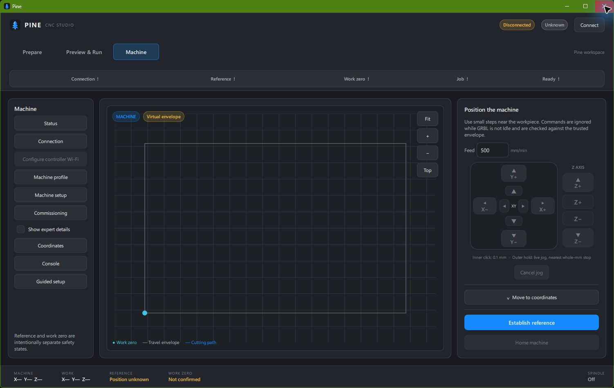
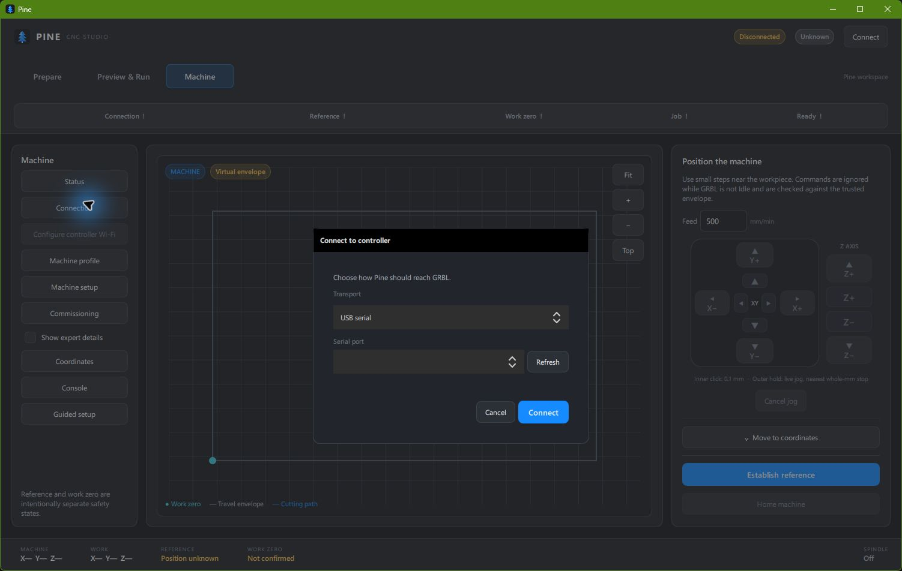
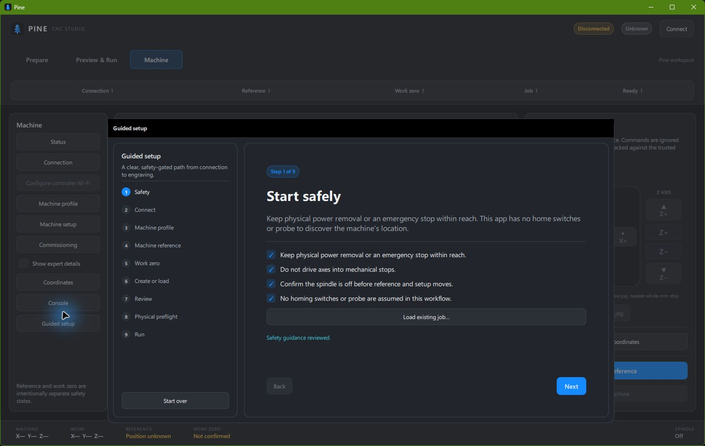
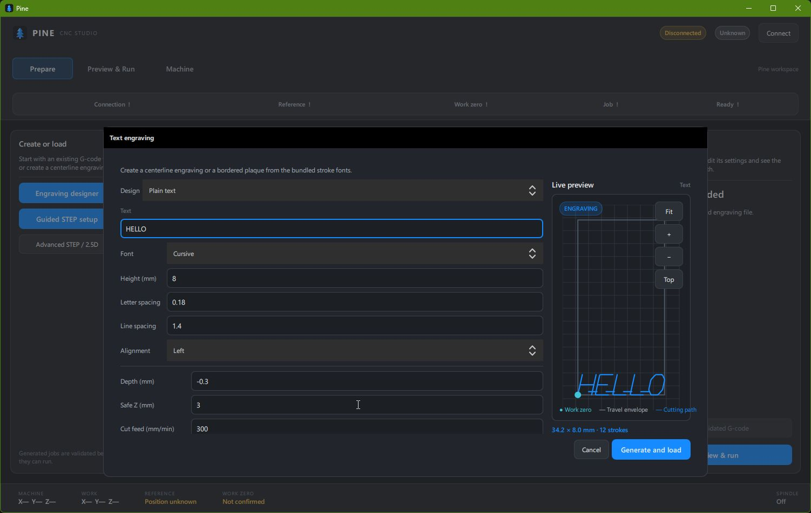
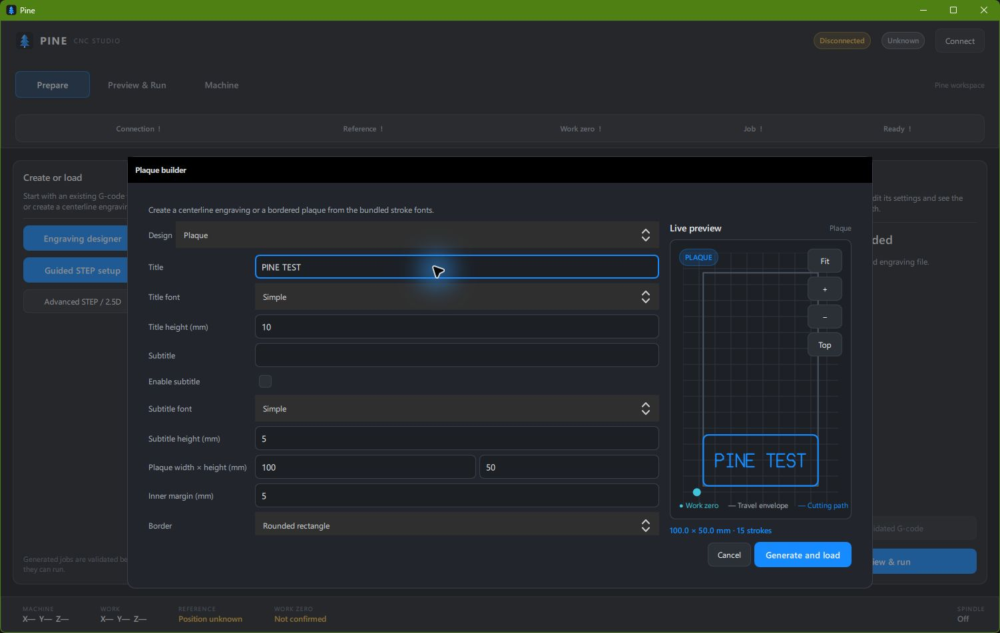
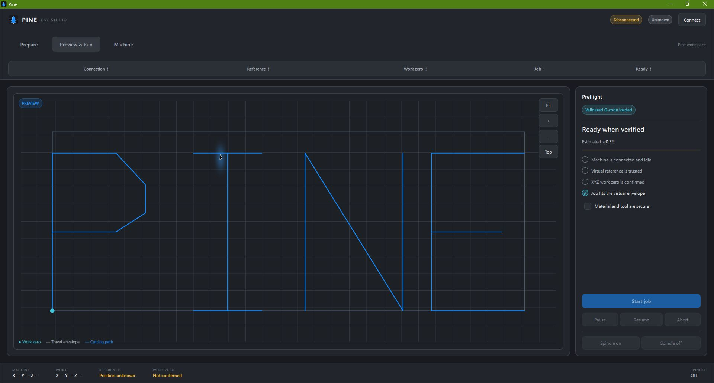
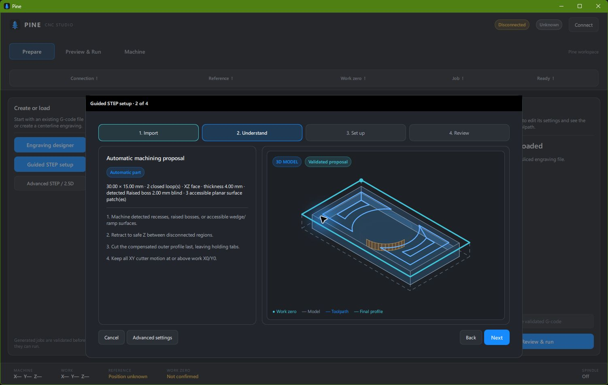
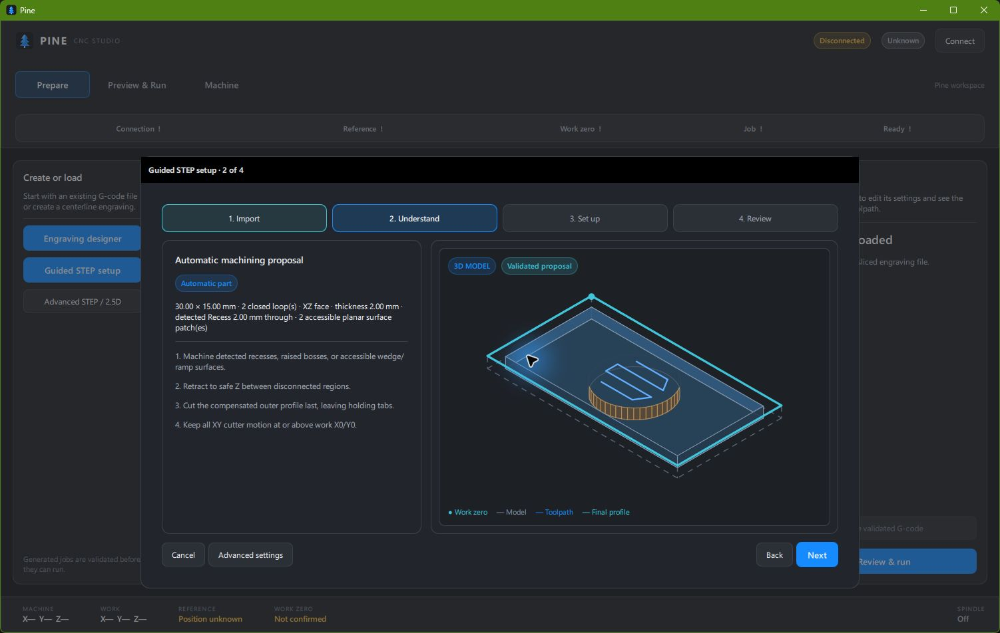
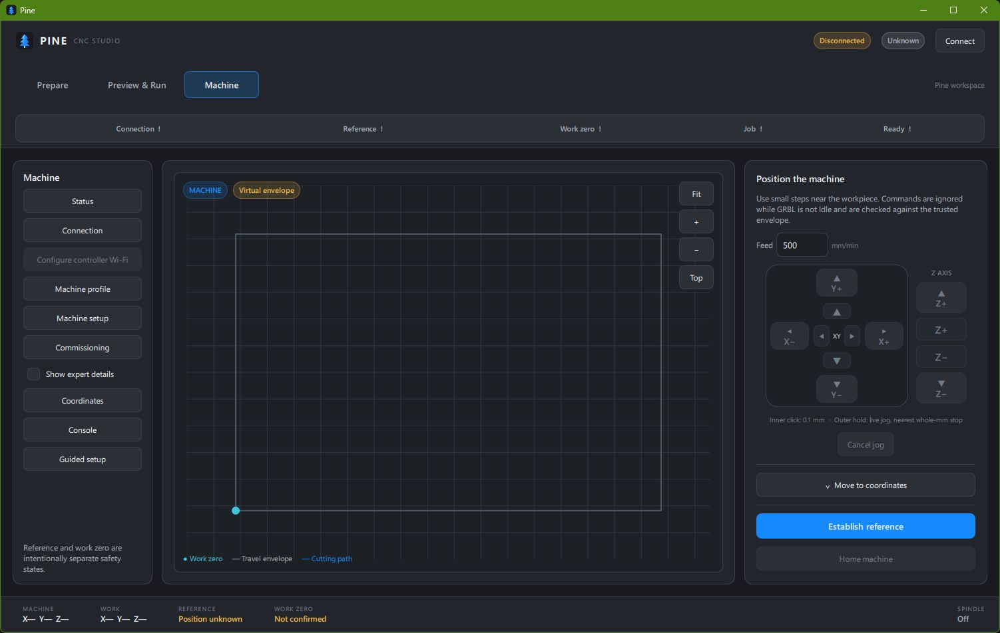

# Pine GUI User-Test Report

**Campaign date:** 2026-09-01  
**Executor:** Luna High via Windows Computer Use (`@oai/sky`)  
**Scope:** Offline GUI testing only; no controller, serial port, TCP/Wi-Fi, spindle, or motion was used.

## Executive verdict

**READY WITH MINOR ISSUES for offline user testing; not approved for hardware operation by this report.**

The current Pine shell is substantially more polished than the earlier desktop UI: Machine opens first, the connection dialog is centered, the main workflow is clearly ordered, status and preflight information are scannable, and the text/plaque/STEP previews are strong. The biggest issue is that loading an existing G-code file through Guided setup did not result in a loaded job after the picker closed. Keyboard focus traversal also appeared stuck on the Pine brand label. The requested 1180×720 pass could not be completed because the available Computer Use surface exposed no reliable resize operation.

Top findings:

1. **P1 — Existing G-code import did not update the job.** Selecting both `air-cut-test.gcode` and `text-engraving.gcode` in Guided setup closed the picker, but the job remained unchanged/not loaded after returning to Preview & Run.
2. **P2 — Keyboard Tab traversal did not advance focus.** Eight consecutive Tab presses continued to report the Pine label as the focused element.
3. **P2 — Splash was not observable.** The first usable observation was already the Machine page; the launch transition completed before it could be captured.
4. **P2 — Constrained-layout pass is incomplete.** The app was observed at 1502×952 and 1920×1032, but the test surface did not provide a reliable way to reach approximately 1180×720.
5. **Positive — STEP classification and preview are compelling.** The three supplied samples produced distinct, understandable proposals without a crash: raised boss, through recess, and accessible ramp surfaces.

## Environment and isolation

- Pine was launched from `C:\Github\3018-cnc\run.py` using the repository virtual-environment Python.
- Each run used a fresh temporary working directory outside the repository, with no connection or work-zero files.
- The live app was selected from `sky.list_apps()`/returned window objects. No pre-existing user-owned Pine instance was disturbed.
- No Connect control, endpoint, discovery, Wi-Fi configuration, GRBL command, jog, reference, work-zero, probe, spindle, Start, Pause, Resume, Abort, or console-send control was activated.
- The isolated Pine instances were closed through their window close control after testing. No isolated window remained.
- Tested samples: `examples/air-cut-test.gcode`, `examples/text-engraving.gcode`, `examples/extruded-circle.step`, `examples/removed-cylinder.step`, and `examples/wedge.step`.
- Normal live capture: 1502×952. Expanded live capture: 1920×1032. The constrained filename is a baseline fallback and is explicitly not a 1180×720 capture.

## Evidence index

Additional evidence: [G-code picker](images/gui-user-test/gcode-picker-current.png), [G-code import issue](images/gui-user-test/issue-GUI-040-gcode-load-picker.png), and [keyboard-focus observation](images/gui-user-test/issue-GUI-062-tab-focus-stuck.png).

## Test matrix

Outcome means the test execution outcome, not hardware readiness. “Partial” records coverage that was safe but incomplete.

| ID | Expected focus | Observed result | Outcome | Evidence / severity |
|---|---|---|---|---|
| GUI-001 | Branded startup, splash, transition to Machine | Pine branding and disconnected Machine state were present; splash transition was too fast to capture live. | Partial | 01; P2 observation |
| GUI-002 | Clear shell hierarchy and readable status strip | Header, three workspaces, readiness strip, status footer, canvas, and controls were visually coherent. | PASS | 02 |
| GUI-003 | Machine → Prepare → Preview & Run → Machine | All workspace transitions completed promptly with correct content. | PASS | 02, 07 |
| GUI-004 | Approx. 1180×720 layout | Resize attempt did not change the window; this surface did not expose a reliable resize operation. | BLOCKED | 11; P2 coverage gap |
| GUI-005 | Normal layout around 1500×920 | 1502×952 layout was usable with no observed overlap; 1920×1032 also rendered cleanly. | PASS | 02, 07 |
| GUI-010 | Scanable coordinates/GRBL/reference/work-zero/spindle | Footer and status strip consistently showed disconnected, unknown, unconfirmed, and spindle Off states. | PASS | 02 |
| GUI-011 | Centered connection dialog; no unsafe connect | Centered dialog exposed USB serial and Wi-Fi/TCP choices; Connect remained untouched/disabled in disconnected state. | PASS | 03 |
| GUI-012 | Safe disconnected readiness routing | Readiness controls were visibly non-ready and motion actions disabled. | Partial | 02 |
| GUI-013 | Correct jog orientation and affordances | Jog cluster was symmetrical and readable; inner 0.1 mm/outer hold instruction was visible; all controls disabled offline. | PASS | 02 |
| GUI-014 | Coordinates collapsed by default and readable when expanded | Disclosure opened to X/Y/Z fields and Move safely, then collapsed cleanly. | PASS | 02 |
| GUI-015 | Reference ordering and Return to work zero placement | Establish reference, Home, Go to reference, zero controls, and Return to work zero appeared in the intended order; Return was below Zero XYZ. | PASS | 02 |
| GUI-016 | Console and guided setup safe navigation | Read-only console opened/closed; Guided setup showed nine steps and correctly blocked progression at Connect while disconnected. | PASS | 04 |
| GUI-020 | Profile fields and safe envelope settings | Profile dialog showed name, X/Y/Z travel, safe Z, and a human-readable active-profile summary. | PASS | — |
| GUI-021 | Setup tabs and optional hardware declarations | Identity/Axes/Hardware tabs were present; hardware options defaulted off and were not saved. | PASS | — |
| GUI-022 | Commissioning all-options-off behavior | Commissioning explicitly reported no optional capabilities and kept homing disabled. | PASS | — |
| GUI-030 | Balanced designer settings plus preview | Designer kept settings and live preview in one modal with clear action buttons. | PASS | 05 |
| GUI-031 | Live text update | Text changed to HELLO and later plaque title to PINE TEST; preview showed an Updating preview state and settled atomically. | PASS | 05, 06 |
| GUI-032 | Three fonts including cursive and sizing controls | Cursive was selectable and visibly changed the toolpath; size/spacing/alignment controls were present. Three distinct font variants were not fully exercised. | Partial | 05 |
| GUI-033 | Inline invalid numeric validation | No invalid numeric value was entered during this safety-isolated pass. | BLOCKED | — |
| GUI-034 | Plaque borders and text clearance | Border menu exposed Rectangle, Rounded rectangle, Double-line, Inset-corner, Scallop, and Simple flourish; rounded preview kept text inside the border. | PASS | 06 |
| GUI-035 | Subtitle disable centers title | Checkbox disabled subtitle controls and preview showed the title centered within the plaque. | PASS | 06 |
| GUI-036 | Designer resize/scroll usability | Normal and expanded views remained readable; constrained resize was unavailable. | Partial | 05, 06 |
| GUI-040 | Load both bundled G-code files | Both bundled files were selected in separate attempts; each picker closed, but the app returned without replacing/loading the job. | FAIL | issue-GUI-040; P1 |
| GUI-041 | Safe preview Fit/zoom/top controls | Controls were visible and correctly placed; no hardware action was taken. | Partial | 07 |
| GUI-042 | Estimate, remaining time, confidence summary | Validated generated G-code showed `Estimated ~0:32`, envelope confidence, prerequisite checklist, and disabled Start while disconnected. | PASS | 07 |
| GUI-043 | Atomic job replacement | Could not complete because existing-file import did not update the job. | BLOCKED | issue-GUI-040; P1 |
| GUI-050 | Extruded-circle import/classification | Imported without crash; proposal reported 30×15 mm, XZ face, 4 mm thickness, raised boss 2 mm, and validated 3D proposal. | PASS | 08 |
| GUI-051 | Removed-cylinder import/classification | Imported distinctly; proposal reported 2 mm thickness and “Recess 2.00 mm through.” | PASS | 09 |
| GUI-052 | Wedge import/classification | Imported and reported 7.98 mm thickness, four planar patches, and accessible ramps. | PASS | 10 |
| GUI-053 | Sequential STEP replacement | Extruded circle → removed cylinder → wedge replaced the prior model/proposal state successfully. | PASS | 08–10 |
| GUI-054 | Responsive recomputation | STEP import showed Importing status and settled to a proposal in roughly 3–7 seconds without UI crash; preview edits showed immediate Updating preview feedback. | PASS | 06, 08–10 |
| GUI-060 | Busy feedback | Text edit showed Updating preview almost immediately; STEP import showed Importing; generation returned a validated result. | PASS | 06, 08 |
| GUI-061 | Duplicate safe local action resistance | No rapid duplicate local action was attempted; hardware actions were intentionally excluded. | BLOCKED | — |
| GUI-062 | Logical Tab traversal | Eight Tab presses continued to report the Pine label as focused rather than advancing through controls. | FAIL | issue-GUI-062; P2 |
| GUI-063 | Safe keys/focus and Escape | Escape closed Guided setup and console cleanly; focus restoration was not fully assessed. | Partial | — |
| GUI-064 | Legibility, contrast, disabled states | Blue accents, muted disabled controls, monospaced coordinates, and non-color textual states were readable at normal size. | PASS | 02, 07 |
| GUI-065 | Error hierarchy | No inline numeric error was triggered. The failed G-code load returned no visible actionable error, which compounds GUI-040. | FAIL | issue-GUI-040; P1 |
| GUI-070 | Safe disconnected close | Disconnected isolated windows closed normally without a reference-move prompt; no isolated window remained. | PASS | — |

## Offline user journey

The intended journey is understandable: open on Machine, connect when ready, establish/reference the machine, set work zero, move to Prepare, create or load a job, review the preview and preflight, then run. In the disconnected campaign, the safe portion was smooth through profile/setup inspection, designer generation, and STEP proposal review. The primary break is the “Load existing job” route: it is discoverable inside Guided setup, but the selected G-code did not appear in the job inspector after the picker closed.

The designer is the strongest workflow. Text and plaque controls are colocated with a live preview, subtitle state is clear, and border styles are easy to discover. STEP import is also persuasive: the app explains what it found rather than silently flattening the supplied models.

## Responsiveness and feedback

- Workspace navigation and modal open/close actions felt immediate, generally under one second.
- Text editing produced visible preview work feedback immediately; the settled preview was observed after approximately 1.2 seconds.
- STEP imports showed an explicit Importing state and settled in approximately 3–7 seconds depending on sample, without a crash or frozen window.
- Local generation returned a validated G-code state and a time estimate.
- The G-code file picker itself behaved normally, but the application did not show a successful load state after acceptance.

## Layout and accessibility

The normal layout is soft, dark, blue-accented, and substantially less boxy than the original desktop shell. Machine’s large canvas/right control split is sensible, and the footer compresses machine/work/reference/work-zero/spindle state effectively. The modal designers use the available width well at normal size. The 1180×720 test remains outstanding because the test surface could not reliably resize the live window.

The main accessibility concern is keyboard traversal: Computer Use reported the Pine brand label as focused after repeated Tab presses. This should be reproduced with a physical keyboard or Qt accessibility tooling before release. Escape behavior was reliable for the safe dialogs tested.

## Defects and recommendations

### P1 — Existing G-code import does not update the active job

**Reproduction:** Open Machine → Guided setup → Load existing job…; select `examples/air-cut-test.gcode` in the Windows picker; click Open; close Guided setup; open Preview & Run.  
**Expected:** The selected filename, validated bounds, preview, estimate, and job state replace the previous job.  
**Observed:** The picker closed, but the active job remained absent/unchanged and Preview & Run still reported no validated job on the first attempt; the route was repeated.  
**Impact:** Users cannot reliably begin from a pre-sliced file, which is a core workflow.  
**Evidence:** [picker capture](images/gui-user-test/issue-GUI-040-gcode-load-picker.png).

**Recommended next step:** Add an integration test around the QML file-dialog accepted URL and `load_gcode_file`, then surface a persistent success or failure status immediately after acceptance.

### P2 — Tab traversal appears stuck on the brand label

**Reproduction:** With the disconnected Machine page visible, press Tab eight times and inspect focus/accessibility state.  
**Expected:** Focus advances through actionable controls in logical order with a visible focus ring.  
**Observed:** Each observation reported the Pine label as focused.  
**Impact:** Keyboard-only users may be unable to discover or operate the workflow.  
**Evidence:** [focus observation](images/gui-user-test/issue-GUI-062-tab-focus-stuck.png).

**Recommended next step:** Reproduce with a physical keyboard, inspect Qt Quick focus scopes/tab fences, and add automated focus-order coverage.

### P2 — Splash and constrained-size evidence remain incomplete

The startup transition completed before a usable live splash capture, and the Computer Use surface did not provide reliable window resizing. These are test-coverage gaps first; verify the actual product splash behavior and run a real 1180×720 pass on a resize-capable workstation.

## Strengths to preserve

- Machine-first opening state and clear disconnected indication.
- Centered, focused connection dialog.
- Strong visual hierarchy with blue Pine accents and readable dark theme.
- Combined text/plaque designer with live preview and explicit subtitle state.
- Six clearly named border styles.
- STEP proposal language that distinguishes raised bosses, through recesses, planar patches, and ramps.
- Preflight checklist, estimate, envelope status, and disconnected Start gating.
- Collapsed coordinate disclosure and safe disabled-state presentation.

## Final readiness decision

Pine is ready for **offline UX user testing and focused bug-fix iteration**. It is not approved for unattended or hardware-connected operation by this campaign. Fix or reproduce the G-code import defect first, then verify keyboard traversal and complete the constrained-size pass. After those checks, Sol Light should review this report and create the next implementation/retest contract.

## Dated correction — G1–G3 picker and focus verification (2026-09-08)

The historical matrix, findings, screenshots, and recommendations above are
retained unchanged. Follow-up public-boundary verification resolved the two
deferred G-code/focus items:

- Offscreen Qt verification using `activeFocusItem` and synthetic Tab events
  observed the actionable sequence `Connect → Prepare → Preview & Run`, with
  subsequent labeled controls receiving focus. No QML focus-scope or tab-order
  policy change was required.
- The native isolated validator `pine-twin-gui-86b054b39f3d` selected
  `examples/air-cut-test.gcode` from the **Load existing job** dialog using the
  G-code filter, and the public UI visibly reported **G-code loaded and
  validated**. The session used only the loopback digital twin and was
  disconnected and closed normally; the validator log reported zero physical
  factory calls.
- Automated public-boundary tests cover valid replacement, invalid-input
  preservation, empty URL, active-job refusal, persistent notices, and the
  accepted QML binding/name filter. The exact commands and counts are recorded
  in the [G1–G3 result evidence](../.codex/sol-luna/EXECUTION_RESULT.md#g1g3-g-code-handoff-and-keyboard-focus-correction-2026-09-08).

The approximately **1180×720 constrained-layout** pass and **splash capture**
remain unobserved coverage gaps. This correction does not approve Pine for
physical commissioning or hardware-connected operation; that boundary remains
intentionally deferred and requires separate explicit authorization and
physical evidence.
